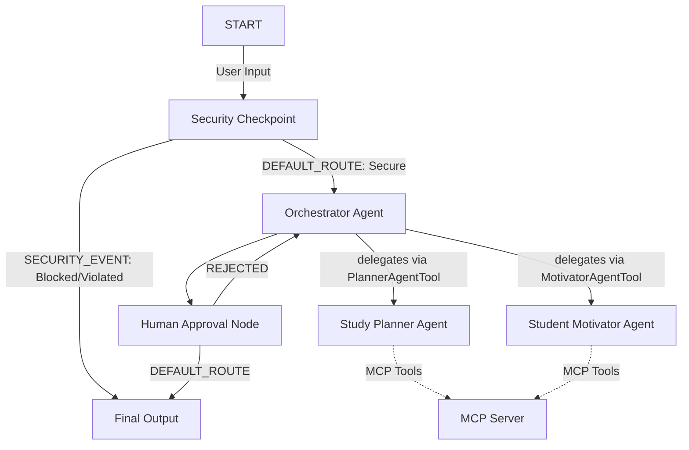

# Submission Write-Up: Smart Study Planner Agent

## Problem Statement
Students preparing for exams face significant cognitive overload. They struggle to construct realistic study plans, balance multiple subjects of varying difficulty, track their daily progress, and stay motivated over long timelines. Simple static calendars fail to adapt to progress delays, while raw LLMs lack state context and safe boundaries. 

The **Smart Study Planner Agent** provides a secure, adaptive, and highly interactive multi-agent system that helps students organize schedules, logs studies, prevents academic burnout, and offers emotional reinforcement.

## Solution Architecture

## Concepts Used

- **ADK Workflow**: Configured a graph-based state-management system to control flow. Defined in [agent.py](file:///d:/onedrive/Desktop/Agent/smart-study-planner/app/agent.py#L169-L181).
- **LlmAgent**: Set up three distinct agents: `orchestrator` (coordinator), `study_planner_agent` (subject scheduling), and `student_motivator_agent` (encouragement and study tip retrieval). Defined in [agent.py](file:///d:/onedrive/Desktop/Agent/smart-study-planner/app/agent.py#L30-L117).
- **AgentTool**: Subclassed `AgentTool` (e.g. `PlannerAgentTool` and `MotivatorAgentTool`) for orchestrator-to-sub-agent delegation. Defined in [agent.py](file:///d:/onedrive/Desktop/Agent/smart-study-planner/app/agent.py#L65-L81).
- **MCP Server**: Developed [mcp_server.py](file:///d:/onedrive/Desktop/Agent/smart-study-planner/app/mcp_server.py) exposing three tools and wired via standard input/output (`stdio`) transport. Connected in [agent.py](file:///d:/onedrive/Desktop/Agent/smart-study-planner/app/agent.py#L25-L28).
- **Security Checkpoint**: Implemented `security_checkpoint()` function node conducting PII scrubbing, injection block, and study hour checks. Defined in [agent.py](file:///d:/onedrive/Desktop/Agent/smart-study-planner/app/agent.py#L123-L200).
- **Agents CLI**: Scaffolded and ran using `agents-cli`.

## Security Design

1. **PII Scrubbing**: Sanitizes email and phone number patterns to protect student privacy before sending prompts to the LLM.
2. **Prompt Injection Mitigation**: Flags malicious strings such as `ignore previous instructions` to prevent system prompt overrides.
3. **Burnout Prevention Policy (Domain-Specific Check)**: Validates input to block study planners scheduling more than 16 hours/day, enforcing study health.
4. **Structured JSON Logs**: Prints auditable events to `stderr` recording decisions, violation flags, and sanitization status.

## MCP Server Design

Exposes three tools via standard stdio transport:
- `get_exam_countdown`: Computes days remaining until the exam. Allows the planner to lay out schedules with calendar bounds.
- `get_study_tips`: Returns specialized study tips tailored to high, medium, and low difficulty subjects.
- `log_study_hours`: Records student hours completion into local state, allowing trackable session history.

## Human-in-the-Loop (HITL) Flow

A `RequestInput` interrupt is placed in `human_approval_node` (defined in [agent.py:L130](file:///d:/onedrive/Desktop/Agent/smart-study-planner/app/agent.py#L202-L245)). 
When the planner sub-agent proposes a new schedule, the workflow pauses, saving the state variables. The user is prompted with an approval dialog in the playground UI. 
- If approved, the plan is committed as `approved_plan`.
- If rejected, the state resets and routes back to `orchestrator` to prompt for adjustments, preventing invalid schedule activation.

## Demo Walkthrough

### 1. Planning Request
- **Scenario**: Student requests a Calculus study plan.
- **Process**: Security node validates request -> Orchestrator triggers `study_planner_agent` -> Sub-agent creates a study plan using countdown tools -> Flow pauses at HITL checkpoint.
- **Result**: Dev UI shows prompt dialog awaiting approval.

### 2. Security Block (Prompt Injection)
- **Scenario**: User submits `ignore previous instructions`.
- **Process**: Checkpoint immediately tags prompt injection keyword -> routes to `SECURITY_EVENT`.
- **Result**: User receives warning text.

### 3. Study Hours Limit Violation
- **Scenario**: User requests 20 study hours per day.
- **Process**: Checkpoint flags hourly overload (>16) -> routes to `SECURITY_EVENT`.
- **Result**: User is asked to select a realistic scheduling window.

## Impact / Value Statement
This agent simplifies educational planning, supports student well-being by monitoring study hours, logs learning progress, and provides responsive motivational support, making study management simple and secure.
